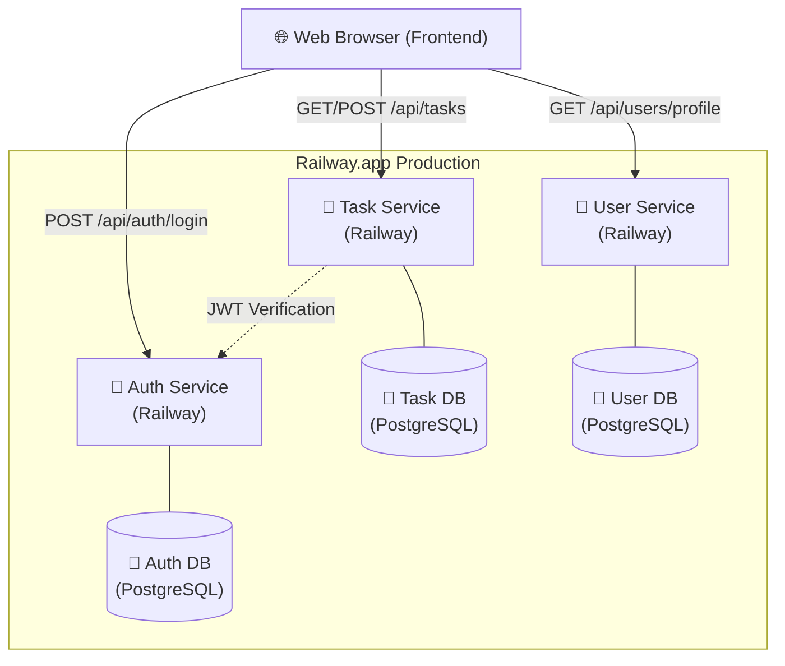

# 🚨 ENGCE301 Software Design and Development

## สมาชิกกลุ่ม

| ชื่อ | รหัสนักศึกษา |
|------|--------------|
| นายณัฐภัทร กลิ่นจันทร์ | 68543206006-7 |
| นันทิพัทธ์ สุกันทา | 68543206045-5 |

---

## ☁️ สถาปัตยกรรมระบบ (Cloud Architecture)



---
URL ของ Service บน Production

auth-service-production-0c97.up.railway.app

task-service-production-3b98.up.railway.app

user-service-production-97ac9.up.railway.app

https://front-end-production-d439.up.railway.app/


## Users

| Username | Email | Password | Role |
|----------|-------|----------|------|
| alice | alice@lab.local | $2a$10$N9qo8uLOickgx2ZMRZoMyeIjZAgcfl7p92ldGxad68LJZdL17lhWy | member |
| bob | bob@lab.local | $2a$10$N9qo8uLOickgx2ZMRZoMyeIjZAgcfl7p92ldGxad68LJZdL17lhWy | member |
| admin | admin@lab.local | $2a$10$N9qo8uLOickgx2ZMRZoMyeIjZAgcfl7p92ldGxad68LJZdL17lhWy | admin |

> ⚠️ passwords ถูก hash ด้วย bcrypt (saltRounds=10) ก่อนเก็บใน DB

---

## 🔒 HTTPS ทำงานอย่างไรในระบบนี้

### ภาพรวม
ระบบนี้ใช้ **TLS Termination ที่ Nginx** หมายความว่า HTTPS ถูกจัดการทั้งหมดที่ Nginx ส่วน services ด้านหลัง (auth, task, log) คุยกันด้วย HTTP ปกติภายใน Docker network ที่ปลอดภัย

### ขั้นตอนการทำงาน

```
Browser ──HTTPS──▶ Nginx ──HTTP──▶ auth-service
                  (TLS จบที่นี่)   task-service
                                   log-service
```

1. **Certificate Generation** — `scripts/gen-certs.sh` สร้าง self-signed certificate (`cert.pem` + `key.pem`) ด้วย OpenSSL สำหรับ `localhost`

2. **HTTP → HTTPS Redirect** — Nginx รับ request ที่ port 80 แล้ว redirect ด้วย `301` ไปที่ port 443 ทุกครั้ง

3. **TLS Termination** — Nginx ถอดรหัส HTTPS และส่งต่อเป็น HTTP ไปยัง services ภายใน Docker network (`taskboard-net`)

4. **TLS Configuration** ที่ใช้:
   - Protocol: `TLSv1.2` และ `TLSv1.3` เท่านั้น (ปิด TLS 1.0/1.1)
   - `ssl_prefer_server_ciphers on` — ให้ server เลือก cipher ที่ปลอดภัยกว่า
   - `ssl_session_cache shared:SSL:10m` — cache TLS session เพื่อประสิทธิภาพ

5. **Security Headers** ที่ส่งทุก response:
   - `Strict-Transport-Security` — บังคับ HTTPS ต่อไปอีก 1 ปี
   - `X-Frame-Options: DENY` — ป้องกัน clickjacking
   - `X-Content-Type-Options: nosniff` — ป้องกัน MIME sniffing
   - `X-XSS-Protection` — เปิด XSS filter ของ browser

6. **Rate Limiting** ที่ Nginx:
   - `/api/auth/login` → 5 requests/นาที (ป้องกัน brute force)
   - `/api/*` → 30 requests/นาที (ป้องกัน DDoS)
   - เกิน limit → ตอบ `429 Too Many Requests`

### ทำไมถึง Self-signed?
เนื่องจากเป็น development environment บน `localhost` จึงไม่สามารถใช้ Certificate Authority จริง (เช่น Let's Encrypt) ได้ Browser จะแสดง warning ว่า "Not Secure" ซึ่งเป็นเรื่องปกติสำหรับ local dev

---

## 🚀 วิธีรัน

### 1. สร้าง Self-signed Certificate (ครั้งแรกเท่านั้น)
```bash
chmod +x ./scripts/gen-certs.sh
./scripts/gen-certs.sh
```

### 2. ตั้งค่า Environment Variables
```bash
cp .env.example .env
# แก้ไข .env ถ้าต้องการเปลี่ยน password หรือ JWT_SECRET
```

### 3. Build และ Start ทุก Container
```bash
docker compose up --build
```

### 4. เข้าใช้งาน
- **Web UI:** https://localhost (กด Advanced → Proceed เพราะใช้ self-signed cert)
- **API:** https://localhost/api/auth/login

### หยุดระบบ
```bash
docker compose down        # หยุด containers
docker compose down -v     # หยุด + ลบ database volume (reset ข้อมูล)
```

---

---

| Test | รายการ (ทดสอบบน Cloud URL) | คะแนน |
|---|---|---|
| T1 | Railway Dashboard เห็น 3 services + 3 databases ทุกอัน status = Active | 10 |
| T2 | POST `/register` บน Railway Auth URL → 201 + user object | 10 |
| T3 | POST `/login` บน Railway Auth URL → JWT token | 10 |
| T4 | POST `/tasks` บน Railway Task URL (มี JWT) → 201 Created | 10 |
| T5 | GET `/tasks` บน Railway Task URL (มี JWT) → tasks list | 10 |
| T6 | GET `/users/profile` บน Railway User URL (มี JWT) → profile | 10 |
| T7 | PUT `/users/profile` บน Railway → อัปเดตสำเร็จ | 5 |
| T8 | GET `/tasks` บน Cloud โดยไม่มี JWT → 401 | 10 |
| T9 | Screenshot Railway env page แสดง JWT_SECRET เหมือนกันทุก service | 5 |
| T10 | README อธิบาย Gateway Strategy + Architecture Cloud | 10 |
| **รวม** | | **90** |
| Bonus | Deploy Nginx Gateway บน Railway (Option B) ทำงานได้จริง | 10 |